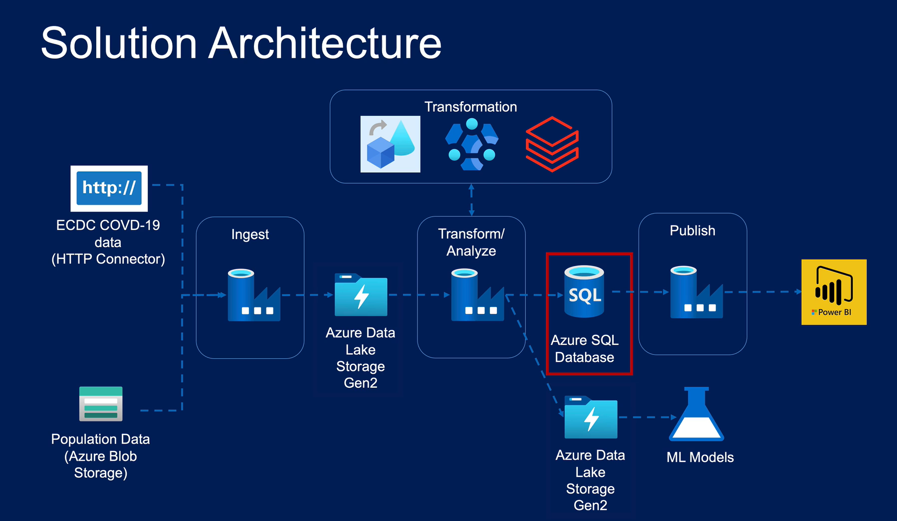

# COVID19-ADF (COVID-19 Analytics and Data Flow)

COVID19-ADF is a project that aims to collect, analyze, and visualize COVID-19 data using Azure services. It retrieves data from the European Centre for Disease Prevention and Control (ECDC) and combines it with population data to gain insights into the impact of the pandemic. The project leverages various Azure services, including Azure Data Lake Gen2, Azure HDInsight, Azure Databricks, Azure SQL Database, and Power BI.

## Architecture

The project architecture consists of several components working together to ingest, transform, analyze, and publish the COVID-19 data.

1. **ECDC COVID-19 Data and Population Data:** The project retrieves COVID-19 data from the ECDC using an HTTP connector. It also utilizes population data from Azure Blob storage.

2. **Ingest:** The data is ingested into Azure Data Lake Gen2, which serves as a centralized storage repository.

3. **Transform and Analyze:** Azure HDInsight and Azure Databricks are used to perform data transformations, exploratory analysis, and advanced analytics on the COVID-19 data.

4. **Azure SQL Database and Azure Data Lake Gen2:** Processed data is stored in an Azure SQL Database for further analysis and querying. Additionally, Azure Data Lake Gen2 is used to store intermediate and refined data sets.

5. **Publish:** The final analyzed and refined data is published and visualized using Power BI, providing insights into the COVID-19 trends and patterns.

## Getting Started

To get started with the COVID19-ADF project, follow these steps:

1. Clone or download the project repository from [GitHub](https://github.com/iBalajiShanmugam/covid19-adf).

2. Set up the necessary Azure services, including Azure Data Lake Gen2, Azure HDInsight, Azure Databricks, Azure SQL Database, and Power BI.

3. Configure the project to connect to the ECDC COVID-19 data source and Azure Blob storage for population data. Refer to the project's documentation for detailed instructions.

4. Run the data ingestion pipeline to retrieve and store the COVID-19 data in Azure Data Lake Gen2.

5. Execute the data transformation and analysis steps using Azure HDInsight and Azure Databricks to gain insights from the COVID-19 data.

6. Store the processed data in Azure SQL Database and Azure Data Lake Gen2 for further analysis and querying.

7. Connect Power BI to the data sources and create visualizations to visualize the COVID-19 trends and patterns.

## Contributing

Contributions to the COVID19-ADF project are welcome. If you find any issues or have suggestions for improvements, please open an issue on the [GitHub repository](https://github.com/iBalajiShanmugam/covid19-adf/issues). Additionally, feel free to submit pull requests with your proposed changes.

When contributing to the project, please follow the existing coding style, guidelines, and best practices. Be sure to include appropriate documentation and tests for your contributions.

## License

This project is licensed under the [MIT License](LICENSE). Feel free to use and modify the code for your own purposes.

## Acknowledgments

- The European Centre for Disease Prevention and Control (ECDC) for providing the COVID-19 data.
- The Azure team for their excellent suite of cloud services.
